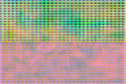
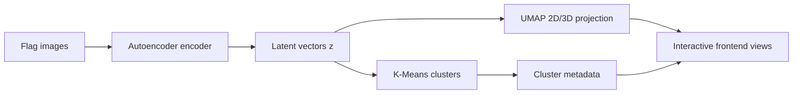

# World Flags Explorer

Interactive web app for exploring visual similarity between world flags using:
- a convolutional autoencoder,
- latent embeddings,
- K-Means clustering,
- UMAP / 3D projections for visualization.

The UI supports two languages (English and Polish), with English as the default.

## Visual Preview

Core samples from this repository:

<p>
  
  
  
</p>

Full autoencoder layer walkthrough (PL sample):

<p>
  
  
  
</p>
<p>
  
  
  
</p>
<p>
  
  
  
</p>

## Architecture At A Glance



## Model Parameters

From `backend/model/model_config.json` and metadata:

- Image size: `64x64` RGB
- Latent dimension: `128`
- Loss: `MSE`
- Training epochs: `100`
- Countries: `250`
- Clusters: `12`
- Scheduler: `ReduceLROnPlateau(patience=10, factor=0.5)`

## Encoder / Decoder Steps

From the `architecture` section in metadata:

1. `Conv2d(3->64, 3x3) + BN + ReLU` -> `64x64`
2. `Conv2d(64->128, 4x4, stride=2) + BN + ReLU` -> `32x32`
3. `Conv2d(128->256, 3x3) + BN + ReLU` -> `32x32`
4. `Conv2d(256->256, 4x4, stride=2) + BN + ReLU` -> `16x16`
5. `Conv2d(256->256, 3x3) + BN + ReLU` -> `16x16`
6. `Linear(65536 -> 128)` bottleneck

Decoder:

1. `Linear(128 -> 65536)`
2. `ConvTranspose2d + Conv2d (256->128->64->3) + Sigmoid` -> `64x64`

### Frontend Experience

- `Explore` mode: cloud + globe for visual navigation
- `Implementation` mode: training curve, reconstruction stages, embedding maps
- Guided onboarding (PL/EN) with highlighted UI sections
- Mobile-tuned controls and zoom behavior for cluster exploration

## Requirements

- Python 3.10+
- Internet connection (required while training to download source flag images)

## Local Run (Backend + Frontend)

```bash
cd backend
python -m venv .venv
source .venv/bin/activate   # Windows: .venv\Scripts\activate
pip install -r requirements.txt

# Training (downloads flags and trains the model; takes a few minutes on CPU)
python train.py

# API server + frontend
uvicorn app:app --reload --host 0.0.0.0 --port 8000
```

Open: `http://localhost:8000`

## Deploy to GitHub Pages (Static)

This repository includes a workflow: `Deploy to GitHub Pages`.
It publishes `frontend/` and copies static assets from `backend/data/` into `frontend/data/`.

### Steps

1. Push the repository to GitHub (`main` branch).
2. In GitHub: **Settings -> Pages -> Source: GitHub Actions**.
3. Wait for the workflow to finish.
4. Your app will be available at:
   `https://<your-username>.github.io/<repo-name>/`

### Static-mode notes

- GitHub Pages does not run the FastAPI backend.
- Flags are loaded from external CDN: `flagcdn.com`.
- Reconstruction view works from pre-generated static assets (`frontend/data/recon_*.png`).

## Project Structure

- `backend/train.py` — data pipeline and model training
- `backend/app.py` — FastAPI application
- `backend/model/` — autoencoder weights and config
- `backend/data/` — training artifacts, metadata, cached assets
- `frontend/` — static HTML/CSS/JS frontend

## API (backend mode)

- `GET /api/flags` — flags list with clusters and 2D embeddings
- `GET /api/metadata` — full metadata (clusters, architecture, reconstructions)
- `GET /api/flag/{code}` — flag image
- `GET /api/export/clusters.csv` — clusters export
